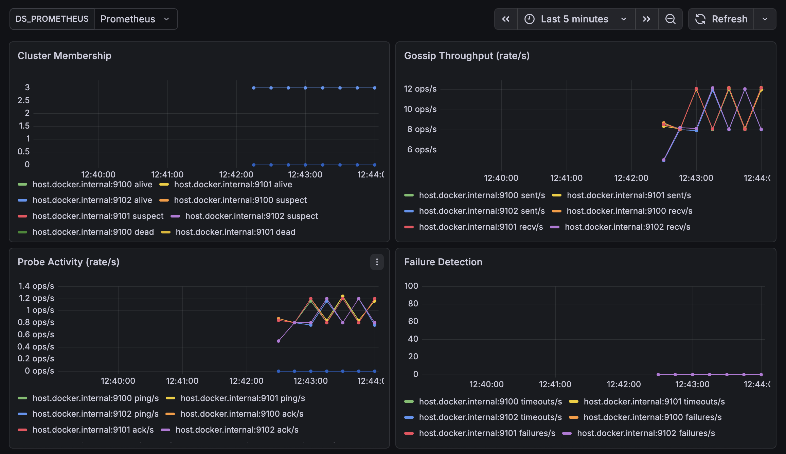
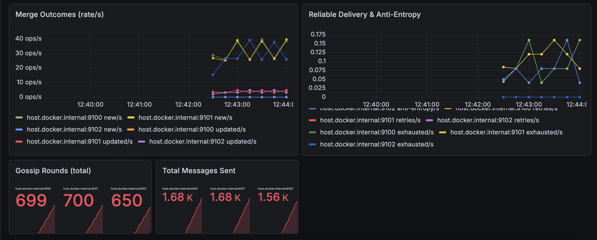

# gossip-membership

A SWIM-style gossip membership protocol implemented from scratch in Rust. Nodes discover each other, detect failures, and maintain a consistent cluster view using epidemic dissemination over UDP.

Built as a learning project to deeply understand distributed systems primitives: failure detection, protocol design, wire formats, and observability.

## Architecture

```
                    +------------------+
                    |    main.rs       |  CLI + config loading
                    +--------+---------+
                             |
                    +--------v---------+
                    |    runner.rs      |  Event loop (7 branches)
                    +--------+---------+
                             |
          +------------------+------------------+
          |                  |                  |
+---------v------+  +--------v-------+  +-------v--------+
|  transport.rs  |  | membership.rs  |  | failure_det.rs |
|  UDP + crypto  |  | Merge rules    |  | SWIM probes    |
+----------------+  +----------------+  +----------------+
          |                  |
+---------v------+  +--------v-------+
|  message.rs    |  |   gossip.rs    |
|  Wire format   |  | Peer selection |
+----------------+  +----------------+
```

### Modules

| Module | Purpose |
|---|---|
| `message.rs` | 24-byte versioned header, 6 message kinds, RFC 1071 checksum, IPv4/IPv6 |
| `membership.rs` | SWIM merge rules: incarnation > heartbeat > status severity |
| `gossip.rs` | Peer selection, adaptive fanout, message construction |
| `failure_detector.rs` | Two-phase probes: direct PING, then indirect PING_REQ |
| `transport.rs` | UDP I/O, ChaCha20-Poly1305 encryption, rate limiting, simulator integration |
| `runner.rs` | Shared event loop (binary + tests), HTTP metrics server |
| `anti_entropy.rs` | Full table sync split into MTU-safe chunks |
| `crypto.rs` | AEAD encryption with per-node AAD authentication |
| `reliable.rs` | REQUEST_ACK timeout/retry tracker |
| `rate_limit.rs` | Token-bucket rate limiter (global + per-peer) |
| `simulator.rs` | Network fault injection: loss, partitions, delay, reordering |
| `metrics.rs` | Protocol counters, Prometheus/JSON export |
| `config.rs` | TOML config file loading with CLI > file > defaults precedence |
| `node.rs` | Node identity, status FSM, 20+ tunable parameters |

## Features

**Core Protocol**
- SWIM failure detection with direct + indirect probes
- Incarnation-based suspicion refutation
- Epidemic gossip dissemination with adaptive fanout
- Anti-entropy full-table sync (MTU-safe chunked)
- Graceful LEAVE with REQUEST_ACK reliable delivery
- Piggybacked membership entries on PING/ACK

**Network & Security**
- ChaCha20-Poly1305 encryption with per-node AAD binding
- Protocol versioning (wire format v1)
- Inbound rate limiting (global + per-peer token bucket)
- IPv4/IPv6 dual-stack

**Observability**
- Prometheus text + JSON metrics export via HTTP `/metrics`
- `/healthz`, `/readyz`, `/membership` operational endpoints
- Pre-built Grafana dashboard (8 panels)
- Docker Compose stack for Prometheus + Grafana
- Periodic console metrics logging

**Testing**
- 260+ tests (unit + integration + property-based)
- Network simulator with loss, partitions, delay, reordering
- cargo-fuzz targets for wire protocol (8M+ iterations, 0 crashes)
- proptest property-based tests for merge algorithm
- Criterion benchmarks for all hot paths

## Quick Start

```bash
# Build
cargo build --release

# Generate a cluster key (optional, for encryption)
cargo run -- --generate-key

# Start a 3-node cluster
cargo run -- --bind 127.0.0.1:7000 --metrics-port 9100 &
cargo run -- --bind 127.0.0.1:7001 --peers 127.0.0.1:7000 --metrics-port 9101 &
cargo run -- --bind 127.0.0.1:7002 --peers 127.0.0.1:7000,127.0.0.1:7001 --metrics-port 9102 &

# Check metrics
curl http://localhost:9100/metrics
curl http://localhost:9100/membership
curl http://localhost:9100/healthz
```

### With encryption

```bash
KEY=$(cargo run -- --generate-key)
cargo run -- --bind 127.0.0.1:7000 --cluster-key $KEY &
cargo run -- --bind 127.0.0.1:7001 --peers 127.0.0.1:7000 --cluster-key $KEY &
```

### With config file

```bash
cargo run -- --config gossip.example.toml --bind 127.0.0.1:7000
```

## Configuration

All fields are optional. Merge precedence: CLI flags > config file > defaults.

```toml
[gossip]
fanout = 50                    # max entries per gossip message
adaptive_fanout = true         # scale fanout with cluster size
max_sends = 1                  # gossip targets per round
interval_ms = 200              # gossip round interval
anti_entropy_interval_ms = 10000

[network]
max_inbound_rate = 500         # global rate limit (tokens/sec)
inbound_peer_capacity = 100    # per-peer burst capacity
# cluster_key = "abcdef..."    # 64 hex chars for encryption

[probes]
timeout_ms = 500               # direct probe timeout
indirect_k = 2                 # indirect probers (PING_REQ)
suspect_timeout_ms = 3000      # suspect -> dead timeout
suspect_multiplier = 0.5       # log2 scaling for cluster size

[metrics]
log_interval_ms = 10000        # console log interval
server_port = 9100             # HTTP metrics port
```

See [`gossip.example.toml`](gossip.example.toml) for all available options.

## Wire Format

24-byte header (big-endian):

```
 Byte  0       : version      (u8)   — protocol version (1)
 Byte  1       : kind         (u8)   — message type
 Bytes 2-3     : payload_len  (u16)
 Bytes 4-11    : sender_id    (u64)
 Bytes 12-15   : heartbeat    (u32)
 Bytes 16-19   : incarnation  (u32)
 Byte  20      : flags        (u8)   — bit-0 = REQUEST_ACK
 Byte  21      : reserved     (u8)
 Bytes 22-23   : checksum     (u16)  — RFC 1071
```

Message kinds: `GOSSIP (0x01)`, `PING (0x02)`, `PING_REQ (0x03)`, `ACK (0x04)`, `LEAVE (0x05)`, `ANTI_ENTROPY (0x06)`

## Observability

```bash
# Start Prometheus + Grafana
cd observability
docker compose up -d

# Or launch the full cluster + monitoring
./observability/run-cluster.sh
```

- **Prometheus**: http://localhost:9090
- **Grafana**: http://localhost:3000 (admin/admin) — dashboard: "SWIM Gossip Protocol"

### Grafana Dashboard





### Metrics exposed

| Metric | Type | Description |
|---|---|---|
| `swim_gossip_rounds_total` | counter | Gossip rounds initiated |
| `swim_gossip_sent_total` | counter | Gossip messages sent |
| `swim_pings_sent_total` | counter | PING messages sent |
| `swim_probe_failures_total` | counter | Probes resulting in Suspect |
| `swim_merges_new_total` | counter | New nodes discovered |
| `swim_anti_entropy_sent_total` | counter | Anti-entropy syncs sent |
| `swim_rate_limited_total` | counter | Packets dropped by rate limiter |
| `swim_members_alive` | gauge | Current Alive members |
| `swim_members_suspect` | gauge | Current Suspect members |
| `swim_members_dead` | gauge | Current Dead members |

## Testing

```bash
# Unit + integration tests
cargo test

# Property-based tests (merge algorithm)
cargo test --test membership_prop_tests

# Fuzz testing (requires nightly)
cargo +nightly fuzz run fuzz_message_decode -- -max_total_time=60
cargo +nightly fuzz run fuzz_wire_node_entry_decode -- -max_total_time=60

# Benchmarks
cargo bench
```

### Test categories

| Category | Count | What it covers |
|---|---|---|
| Unit tests | 218 | Merge rules, wire codec, peer selection, crypto, rate limiting |
| Integration tests | 39 | Multi-node convergence, encryption, partitions, failure detection |
| Property tests | 9 | Merge commutativity, idempotency, Dead-terminality, convergence |
| Fuzz targets | 2 | Message::decode, WireNodeEntry::decode (8M+ iterations) |
| Benchmarks | 26 | Merge, codec, gossip construction, anti-entropy chunking |

## SWIM Protocol Implementation

This implementation follows the [SWIM paper](https://www.cs.cornell.edu/projects/Quicksilver/public_pdfs/SWIM.pdf) with extensions:

1. **Failure Detection**: Each probe cycle picks a random peer and sends PING. If no ACK within `probe_timeout_ms`, escalates to indirect probing via `k` intermediaries (PING_REQ). If still no response, the node is marked Suspect.

2. **Suspicion**: Suspect nodes get a jittered timeout scaled by `log2(cluster_size)`. If the timeout expires without refutation, the node is declared Dead. The jitter is deterministic per `(observer, suspect)` pair to prevent thundering herd.

3. **Incarnation Refutation**: When a node learns it's been suspected, it increments its incarnation number and re-asserts Alive — without inflating its heartbeat counter.

4. **Merge Rules** (priority order):
   - Higher incarnation always wins
   - Dead at same incarnation is terminal (blocks Alive/Suspect)
   - Same incarnation: higher heartbeat wins
   - Same incarnation + heartbeat: more severe status wins (Dead > Suspect > Alive)

5. **Anti-Entropy**: Periodic full-table sync compensates for sustained packet loss. Large tables are split into MTU-safe chunks with reassembly on the receiver.

## Project Structure

```
gossip-membership/
├── src/
│   ├── main.rs              # CLI entry point
│   ├── lib.rs               # Module exports
│   ├── runner.rs            # Event loop + HTTP server
│   ├── message.rs           # Wire format (829 lines)
│   ├── membership.rs        # Merge rules (1053 lines)
│   ├── gossip.rs            # Peer selection + fanout
│   ├── transport.rs         # UDP + encryption + rate limiting
│   ├── failure_detector.rs  # SWIM probes
│   ├── anti_entropy.rs      # Chunked full sync
│   ├── crypto.rs            # ChaCha20-Poly1305
│   ├── reliable.rs          # REQUEST_ACK retries
│   ├── rate_limit.rs        # Token bucket
│   ├── simulator.rs         # Network fault injection
│   ├── metrics.rs           # Counters + export
│   ├── config.rs            # TOML config
│   └── node.rs              # Identity + config
├── tests/
│   ├── gossip_tests.rs      # 39 integration tests
│   └── membership_prop_tests.rs  # 9 property tests
├── benches/
│   └── protocol_bench.rs    # Criterion benchmarks
├── fuzz/
│   └── fuzz_targets/        # cargo-fuzz targets
├── observability/
│   ├── docker-compose.yml   # Prometheus + Grafana
│   ├── prometheus.yml
│   ├── run-cluster.sh
│   └── grafana/             # Dashboard + provisioning
├── gossip.example.toml      # Example config
└── Cargo.toml
```

## License

This is a learning project. Use it however you like.
