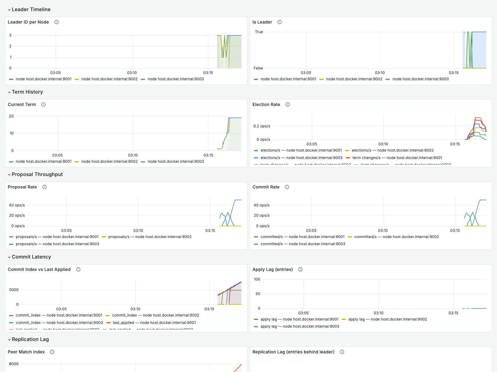
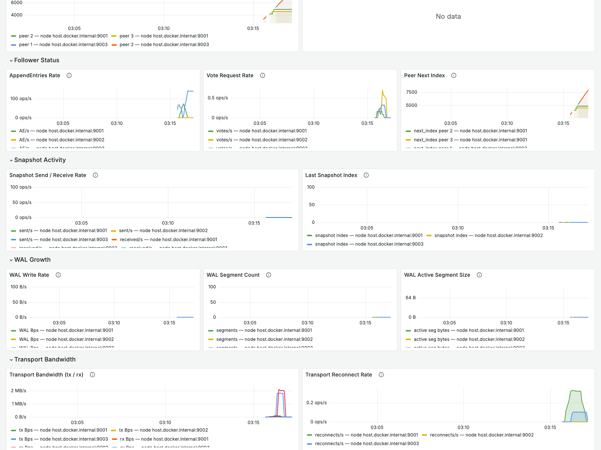

# Raft Consensus Algorithm in Rust

A from-scratch implementation of the Raft consensus algorithm in Rust, built to understand distributed consensus by implementing every major subsystem manually — not as a library wrapper, but as a ground-up construction of each protocol mechanism.

The implementation covers the full Raft protocol as described in the [extended paper](https://raft.github.io/raft.pdf) and [dissertation](https://web.stanford.edu/~ouster/cgi-bin/papers/OngaroPhD.pdf), including extensions beyond the original paper:

| Subsystem | Description |
|---|---|
| Leader election | Randomised timeouts, split-vote recovery, election safety |
| PreVote | §9.6 — prevents partitioned nodes from disrupting the cluster on rejoin |
| Log replication | AppendEntries, consistency check, follower log repair |
| Commit rule | Only entries from the current term; prior-term entries committed transitively |
| Joint consensus | §6 — safe cluster membership changes via overlapping majorities |
| Leadership transfer | Dissertation §3.10 — graceful handoff via TimeoutNow |
| ReadIndex | §8 — linearisable reads without touching the log |
| Snapshotting | InstallSnapshot, compaction, log prefix trimming |
| Crash recovery | Durable term, vote, and log; rebuild volatile state on restart |
| Segmented WAL | CRC32-framed, segment-rotating, fsync-policy-configurable |
| Async TCP transport | Length-prefixed framing, reconnect with exponential backoff |
| Prometheus metrics | 22+ counters and gauges; per-peer replication tracking |
| Deterministic simulator | In-process cluster simulation, partitions, crashes, seeded PRNG |
| cargo-fuzz | 3 fuzz targets covering wire decode, message roundtrip, snapshot decode |
| Criterion benchmarks | 7 benchmark groups covering encode, decode, log append, commit, snapshot |

---

## Why Raft?

Distributed systems frequently need to agree on a sequence of operations — which write wins, which configuration is current, who is the primary. Without coordination, two nodes can simultaneously believe they are the leader, apply conflicting commands, and diverge permanently. **Consensus** is the mechanism that prevents this.

The textbook framing is the **replicated state machine**: every node executes the same sequence of commands in the same order against an identical state machine. Agreement on the command log is equivalent to agreement on the machine state. The question becomes: how do a set of nodes agree on a growing, append-only log, in the presence of failures?

Raft answers this with three properties:

**Leader-based replication.** At any time at most one leader exists per term. The leader is the sole source of new log entries; followers only accept entries from the leader. This removes the multi-leader complexity that makes Paxos hard to understand.

**Majority quorums.** A cluster of `2f+1` nodes can tolerate `f` simultaneous failures. An operation is committed once a strict majority (`f+1` nodes) has durably stored it. No minority of nodes can commit on its own, so a split-brain that happens to reach a majority-sized partition is the only risk — and the term number prevents two separate majorities from existing at the same time.

**Linearisability.** Once a write is committed, every subsequent read from any node in any future term reflects it. No stale reads, no rollback of committed data. This is the strongest consistency guarantee for a distributed system: the cluster behaves, from the outside, like a single thread executing commands one at a time.

**Why Raft and not Paxos?** Paxos is famously difficult to extend from single-value consensus to a practical replicated log. Real systems end up implementing "Multi-Paxos" which the original paper does not describe. Raft was designed from first principles with understandability as an explicit goal — a fixed leader, a single-round commit path, and mechanisms named and documented to match their purpose. This codebase exists because Raft's structure maps cleanly onto implementable code.

---

## Architecture Overview

```
  ┌─────────────────────────────────────────────────────────┐
  │  Clients                                                 │
  │  propose(data) / read_index() / add_node() / transfer() │
  └────────────────────────┬────────────────────────────────┘
                           │
  ┌────────────────────────▼────────────────────────────────┐
  │  RaftNode  (pure deterministic state machine)            │
  │                                                          │
  │  step(envelope)   — deliver inbound RPC                  │
  │  tick(n)          — advance logical time                 │
  │  drain_messages() — collect outbound RPCs                │
  │  drain_applied()  — collect committed entries            │
  │  drain_read_results() — deliver confirmed reads          │
  └──────┬─────────────────────────────────┬────────────────┘
         │                                 │
  ┌──────▼──────┐                   ┌──────▼──────┐
  │  Storage     │                   │  RaftLog     │
  │              │                   │              │
  │  save_term   │                   │  append      │
  │  save_vote   │                   │  truncate    │
  │  append_log  │                   │  get(index)  │
  │  save_snap   │                   │  last_index  │
  │  load_state  │                   │  term_at     │
  └──────┬───────┘                   └─────────────┘
         │
  ┌──────▼──────────────────────────────────────────────────┐
  │  WalStorage  (production)   MemoryStorage  (tests)       │
  │                                                          │
  │  Segmented append-only files  │  HashMap + Vec            │
  │  CRC32-framed records         │  No I/O                   │
  │  3 FsyncPolicy modes          │  Clone-on-crash           │
  │  Crash recovery on open()     │                           │
  └─────────────────────────────────────────────────────────┘

  ┌─────────────────────────────────────────────────────────┐
  │  TcpTransport / NodeRunner   (async, tokio)              │
  │                                                          │
  │  Drives RaftNode from the network edge:                  │
  │  • accept_loop → reader_task per connection              │
  │  • peer_writer_task per peer (reconnect with backoff)    │
  │  • ticker fires tick() at configurable interval          │
  │  • propose_rx delivers client proposals                  │
  └──────────────────────────────┬──────────────────────────┘
                                  │
  ┌───────────────────────────────▼─────────────────────────┐
  │  MetricsServer  (HTTP, std::net)                         │
  │  /metrics  — Prometheus text format                      │
  │  /raft     — JSON state snapshot                         │
  │  /healthz  — liveness probe                              │
  └─────────────────────────────────────────────────────────┘
```

The core design is the **pure state machine pattern** used by etcd/raft: `RaftNode` has no threads, no async runtime, no sockets, and no I/O. It takes inputs (`step`, `tick`) and produces outputs (`drain_messages`, `drain_applied`). The caller — whether a real async TCP transport or an in-process test simulator — owns all I/O. This makes the node fully deterministic and independently testable at any level of the stack.

---

## Consensus Flow

### Leader Election

```
Follower                       Candidate                      Leader
  │                               │                              │
  │  (election_timeout fires)     │                              │
  ├──── become_candidate ────────►│                              │
  │                               │  increment term              │
  │                               │  vote for self               │
  │                               │  reset random timer          │
  │                               │──── RequestVote ────────────►│
  │                               │◄──── grant ─────────────────│
  │                               │  (collect majority)          │
  │                               │──── become_leader ──────────►│
  │                               │                              │
  │◄─────────────────────── AppendEntries (noop) ───────────────│
```

The election timeout is randomised per node (`[min, max)` ticks) on each reset. This spreads out candidacy attempts so that, in most cases, one candidate issues RequestVote before others wake up. A split vote results in everyone timing out and retrying with a fresh random interval — guaranteed to resolve eventually.

A newly elected leader immediately appends a **no-op entry** in its own term. This matters because Raft's commit rule (§5.4.2) forbids committing entries from prior terms by counting replicas alone — a leader can only safely commit an entry from a prior term by committing a current-term entry that follows it.

### Log Replication

```
Leader  ────────────────────────────────────────────────────────────
  │   propose(data)
  │   append to local log [index=5, term=3]
  │   persist to WAL
  │
  ├──── AppendEntries ────────────────────────────► Follower A
  │     prev_log_index=4, prev_log_term=3           │
  │     entries=[{term:3, data}]                    │ consistency check
  │                                                 │ append if ok
  │◄─── success, match_index=5 ─────────────────────┤
  │
  ├──── AppendEntries ────────────────────────────► Follower B
  │◄─── success, match_index=5 ─────────────────────┤
  │
  │  majority reached (A + self = 3/3 in this example)
  │  commit_index = 5
  │  apply entry 5 to state machine
  │  next heartbeat carries leader_commit=5
  │  followers advance their own commit_index
```

The **consistency check** (`prev_log_index`, `prev_log_term`) is the heart of the Log Matching Property. Before accepting new entries a follower verifies that its log matches the leader's at the index just before the new entries. A mismatch means the follower's log has diverged — the leader walks `next_index` backward until it finds a common prefix, then resyncs the suffix.

### Crash Recovery

```
  crash                  restart
    │                       │
    │                       ├── WalStorage::open()
    │                       │   read all segments in ID order
    │                       │   stop at first CRC mismatch or truncation
    │                       │   truncate partial tail record
    │                       │
    │                       ├── load_state() → HardState
    │                       │   { current_term, voted_for, log: [...] }
    │                       │
    │                       ├── RaftNode::restore(storage, log, snapshot)
    │                       │   rebuild volatile state
    │                       │   snapshot → snapshot_index, snapshot_term
    │                       │   log entries appended on top
    │                       │
    │                       └── rejoin cluster as follower
```

Three things must survive a crash for Raft safety:
1. **`current_term`** — a node that forgets its term can vote twice in the same term, violating Election Safety.
2. **`voted_for`** — must be durable before granting a vote; otherwise a restart could grant two votes in the same term.
3. **Log entries** — a node that acknowledged an entry must not lose it; the leader counted it toward majority.

The WAL persists all three atomically (via CRC32 framing and fsync), and the ordering invariant is strict: every write to the WAL completes before the node sends the RPC response that depends on it.

---

## Project Features

### Consensus

| Feature | Notes |
|---|---|
| Leader election | Randomised timeout in `[min, max)` ticks; split-vote recovery |
| PreVote | A node must win a speculative pre-vote round before incrementing its term |
| Log replication | AppendEntries with full consistency check; retry with decremented `next_index` |
| Commit rule | Only current-term entries; prior-term entries committed transitively via no-op |
| Heartbeats | Periodic empty AppendEntries to suppress follower election timeouts |
| Follower log repair | Leader backtracks `next_index` until a common prefix is found |
| Joint consensus | AddNode/RemoveNode require overlapping majorities of old and new config |
| Leadership transfer | Leader replicates fully to target, then sends TimeoutNow |
| ReadIndex | Leader confirms leadership via heartbeat quorum; no log write required |
| Snapshotting | InstallSnapshot RPC; log prefix trim; atomic snapshot write + WAL record |
| State machine safety | Only one entry applied at each index, across any node, in any term |

### Persistence

The `Storage` trait decouples the protocol from the persistence backend:

```rust
pub trait Storage {
    fn save_term(&mut self, term: Term) -> Result<()>;
    fn save_vote(&mut self, voted_for: Option<NodeId>) -> Result<()>;
    fn append_log_entries(&mut self, entries: &[LogEntry]) -> Result<()>;
    fn truncate_log(&mut self, from_index: LogIndex) -> Result<()>;
    fn load_state(&self) -> Result<HardState>;
    fn save_snapshot(&mut self, snapshot: &Snapshot) -> Result<()>;
    fn load_snapshot(&self) -> Result<Option<Snapshot>>;
}
```

`MemoryStorage` is used throughout tests and the simulator. `WalStorage` is the production backend:

**Segmented WAL** — State is written as a sequence of CRC32-framed records across fixed-size segment files (default 64 MiB). Active segments grow until the size limit, then a new segment is opened. Old segments are never rewritten.

```
WAL record frame:
┌──────────────┬──────────────────┬────────────┬──────────────────────┐
│ crc32 (4 B)  │ payload_len (4 B) │ kind (1 B) │  payload (N bytes)   │
└──────────────┴──────────────────┴────────────┴──────────────────────┘
```

CRC32 is computed over `[payload_len | kind | payload]`. Five record kinds: `Term`, `Vote`, `Entry`, `Truncate`, `SnapshotMeta`.

**Crash recovery** — On open, all segments are replayed in ID order. Reading stops at the first CRC mismatch, truncated frame, or unknown kind. The partial-write tail is truncated; all subsequent segments are deleted. This makes recovery O(log size) for a well-functioning cluster (only a few recent segments), and safe even for a crash mid-write.

**FsyncPolicy** — Three modes: `Always` (safest, one fsync per write), `EveryN(Duration)` (periodic, bounded loss window), `Never` (OS page-cache only).

**Snapshots** — Written to `snapshot.bin` via atomic write-then-rename, followed by a `SnapshotMeta` WAL record. On recovery, the snapshot file is the authoritative source.

### Networking

TCP transport with length-prefixed framing:

```
Frame layout:
[4: body_len u32 BE] [8: from u64 BE] [8: to u64 BE] [N: wire-encoded Rpc]
```

Each peer gets a dedicated writer task that maintains the TCP connection and reconnects with exponential backoff (`100ms → 5s`). Messages queued during a disconnect are flushed once the connection is re-established.

The wire codec is hand-rolled — no protobuf, no bincode. Every Raft RPC variant has a fixed layout with a 1-byte type tag:

```
Tag 1 — RequestVote:          33 bytes
Tag 2 — RequestVoteResponse:  10 bytes
Tag 3 — AppendEntries:        45 bytes + entry data
Tag 4 — AppendEntriesResponse:18 bytes
Tag 5 — PreVote:              33 bytes
Tag 6 — PreVoteResponse:      10 bytes
Tag 7 — InstallSnapshot:      46 bytes + data
Tag 8 — InstallSnapshotResponse: 9 bytes
```

### Observability

The metrics HTTP server runs in a dedicated thread alongside the Raft event loop. The node carries an `Arc<RaftMetrics>` that both threads read and write lock-free via `AtomicU64`. Per-peer maps use `Mutex<HashMap<u64, u64>>` held briefly during render and update.

```bash
curl 127.0.0.1:9001/metrics   # Prometheus text exposition format 0.0.4
curl 127.0.0.1:9001/raft      # JSON state snapshot
curl 127.0.0.1:9001/healthz   # {"status":"ok"} liveness probe
```

### Testing

```bash
cargo test                        # 319+ tests (unit + integration)
cargo +nightly fuzz run wire_decode -- -max_total_time=60
cargo +nightly fuzz run message_roundtrip -- -max_total_time=60
cargo +nightly fuzz run snapshot_decode -- -max_total_time=60
cargo bench                       # Criterion benchmarks (HTML report in target/criterion)
```

---

## Repository Structure

```
raft-consensus/
├── src/
│   ├── lib.rs               Module re-exports
│   ├── state.rs             Type aliases: NodeId, Term, LogIndex
│   ├── message.rs           RPC definitions: RequestVote, AppendEntries, PreVote,
│   │                          InstallSnapshot, ReadIndex, TimeoutNow + Envelope routing
│   ├── log.rs               LogEntry, RaftLog trait, InMemoryLog, Command enum
│   │                          (Noop / Put / Delete / AddNode / RemoveNode)
│   ├── storage.rs           Storage trait, HardState, Snapshot, MemoryStorage,
│   │                          StorageError
│   ├── node.rs              RaftNode<S, L> — full consensus state machine (6,975 lines):
│   │                          election, replication, commit, apply, PreVote,
│   │                          joint consensus, leadership transfer, ReadIndex,
│   │                          snapshotting, compaction, persistence hooks
│   ├── wire.rs              Hand-rolled binary codec: encode/decode all Rpc variants
│   ├── wal.rs               WalStorage: CRC32-framed segmented WAL, FsyncPolicy,
│   │                          crash recovery, snapshot atomics, metrics wiring
│   ├── simulator.rs         Deterministic in-process cluster simulator:
│   │                          tick, stabilize, partition, heal, crash, restart,
│   │                          add_node, remove_node, seeded SplitMix64 PRNG
│   ├── transport.rs         Async TCP transport: TcpTransport, NodeRunner, NodeHandle,
│   │                          peer_writer_task with backoff, accept_loop, read_frame
│   ├── metrics.rs           RaftMetrics: 22+ atomic counters/gauges, per-peer maps,
│   │                          render_prometheus() / render_json()
│   ├── server.rs            MetricsServer: HTTP/1.0 server on std::net::TcpListener
│   └── bin/
│       ├── raft_node.rs     Standalone node binary: --id, --addr, --peer, --metrics,
│       │                      --tick-ms; status logger
│       └── raft_demo.rs     3-node live demo: elect, propose, print applied entries
├── tests/
│   └── metrics_server_tests.rs   26 integration tests: HTTP endpoints, metric values,
│                                   node operations visible through /metrics
├── benches/
│   └── raft_benchmarks.rs   Criterion: 7 benchmark groups
├── fuzz/
│   └── fuzz_targets/
│       ├── wire_decode.rs          Fuzz arbitrary bytes through wire::decode
│       ├── message_roundtrip.rs    Fuzz encode → decode → encode round-trip
│       └── snapshot_decode.rs      Fuzz InstallSnapshot deserialization
├── observability/
│   ├── docker-compose.yml   Prometheus 2.52 + Grafana 10.4
│   ├── prometheus.yml       Scrapes 3 nodes at 5s via host.docker.internal
│   ├── run-cluster.sh       Build + start 3-node cluster
│   └── grafana/             Provisioned datasource + 27-panel dashboard
└── docs/
    └── observability.md     Metrics reference, setup guide, PromQL queries
```

---

## Implemented Features

- [x] Raft paper §5: leader election, log replication, safety
- [x] Randomised election timeout (split-vote avoidance)
- [x] Vote persistence before granting (Election Safety)
- [x] Log persistence before ACKing (Log Durability)
- [x] No-op entry on election (commit inherited entries)
- [x] Follower log repair (next_index backtrack + resync)
- [x] Majority commit: only current-term entries count directly
- [x] Prior-term entries committed transitively via current-term no-op
- [x] AppendEntries consistency check (prev_log_index / prev_log_term)
- [x] Heartbeats with leader_commit piggyback
- [x] PreVote (§9.6): speculative round before incrementing term
- [x] InstallSnapshot RPC (§7): full log replacement
- [x] Log compaction: `compact()` trims prefix, updates snapshot index/term
- [x] Crash recovery: WAL replay → HardState → `RaftNode::restore()`
- [x] Joint consensus (§6): `AddNode` / `RemoveNode` with overlapping majorities
- [x] Leadership transfer (dissertation §3.10): `TimeoutNow` after log catch-up
- [x] ReadIndex (§8): linearisable reads via heartbeat quorum, follower forwarding
- [x] Segmented WAL with CRC32 framing and partial-write recovery
- [x] Three fsync policies: Always / EveryN(Duration) / Never
- [x] Atomic snapshot write (write-then-rename)
- [x] `Storage` trait abstraction (swap MemoryStorage ↔ WalStorage)
- [x] `RaftLog` trait abstraction
- [x] Hand-rolled binary wire codec (zero external serialization dependencies)
- [x] Async TCP transport with per-peer writer tasks
- [x] Exponential backoff reconnect (`100ms → 5s`)
- [x] Message buffering during disconnect, flush on reconnect
- [x] Deterministic in-process cluster simulator (partitions, crashes, loss, delay)
- [x] 22+ Prometheus metrics (counters + gauges + per-peer labels)
- [x] HTTP metrics server (`/metrics` / `/raft` / `/healthz`)
- [x] Prometheus + Grafana observability stack (Docker Compose)
- [x] 27-panel Grafana dashboard (9 sections)
- [x] 3 cargo-fuzz targets (wire decode, message roundtrip, snapshot decode)
- [x] Criterion benchmarks (7 groups)
- [x] 319+ tests, zero compiler warnings

---

## Quick Start

```bash
# Build
cargo build --release

# Run a 3-node cluster (three terminals)
cargo run --bin raft_node -- --id 1 --addr 127.0.0.1:7001 \
    --peer 2=127.0.0.1:7002 --peer 3=127.0.0.1:7003 --metrics 127.0.0.1:9001

cargo run --bin raft_node -- --id 2 --addr 127.0.0.1:7002 \
    --peer 1=127.0.0.1:7001 --peer 3=127.0.0.1:7003 --metrics 127.0.0.1:9002

cargo run --bin raft_node -- --id 3 --addr 127.0.0.1:7003 \
    --peer 1=127.0.0.1:7001 --peer 2=127.0.0.1:7002 --metrics 127.0.0.1:9003

# Poll any node for cluster state
curl 127.0.0.1:9001/raft | jq .

# Or use the one-shot script
./observability/run-cluster.sh
cd observability && docker compose up -d   # Grafana at http://localhost:3000
```

### Embedding the node in your own runtime

```rust
use raft_consensus::node::{RaftNode, ClusterConfig};
use raft_consensus::simulator::Simulator;

// In-process simulation (no I/O, deterministic)
let config = ClusterConfig {
    election_timeout_min: 10,
    election_timeout_max: 20,
    heartbeat_interval: 5,
    pre_vote: true,
};
let mut sim = Simulator::new(3, config, /* seed */ 42);
sim.elect(1);
sim.propose(b"hello".to_vec());
sim.stabilize();
sim.assert_one_leader();
sim.assert_logs_consistent();
```

```rust
// Real TCP transport (async, tokio)
use raft_consensus::transport::NodeRunner;

let (runner, handle) = NodeRunner::new(
    1,
    vec![(2, "127.0.0.1:7002".parse()?)],
    "127.0.0.1:7001".parse()?,
    config,
    10, // tick_ms
).await?;

tokio::spawn(runner.run());
handle.propose(b"hello".to_vec());
```

---

## Benchmarks

Criterion benchmarks are in `benches/raft_benchmarks.rs`. Run with `cargo bench`; HTML reports land in `target/criterion/`.

| Group | What is measured | Why it matters |
|---|---|---|
| `append_entries_encode` | Wire-encoding AppendEntries at 1, 10, 100, 1000 entries | Encodes on every replication; hot path under high proposal rate |
| `append_entries_decode` | Wire-decoding the same sizes | Hot on the follower receive path |
| `request_vote_encode/decode` | Single fixed-size RequestVote | Baseline for the codec overhead |
| `log_append` | `InMemoryLog::append` at 1, 10, 100, 1000 entries | Proposal latency is dominated by log append under batch load |
| `commit_advancement` | `maybe_advance_commit_index` over N match indices | Called after every AppendEntriesResponse; cost scales with cluster size |
| `snapshot_install` | Full `handle_install_snapshot` at 1 KiB, 1 MiB, 10 MiB | InstallSnapshot is the worst-case catch-up path; must complete before the next heartbeat timeout |

Throughput benchmarks measure steady-state replication. Latency benchmarks are single-operation to isolate per-call overhead. The commit advancement benchmark exercises the sort-and-search over match indices — the operation that runs on every follower ACK in a loaded cluster.

---

## Testing Strategy

The test suite has 319+ tests across four layers. Every layer targets a distinct failure mode.

**Unit tests (293)** live alongside the source code in `#[cfg(test)]` modules. They test individual invariants in isolation — a follower rejects a RequestVote from a candidate with a stale log, a leader does not commit an entry from a prior term by counting replicas alone, a WAL recovers cleanly after a truncated tail record, a CRC mismatch stops recovery and removes subsequent segments. Because `RaftNode` has no I/O, each unit test constructs a node directly, delivers hand-crafted envelopes, and asserts on the outbox and applied log. No mocking required.

**Deterministic simulation (22 tests in `simulator.rs`)** exercises the cluster as a whole. The `Simulator` owns multiple `RaftNode` instances and a virtual network that delivers messages at configurable delays and loss rates. A seeded SplitMix64 PRNG makes every test reproducible. Tests cover partition and heal cycles, crash-and-restart with log divergence, joint consensus transitions, leadership transfer, and ReadIndex confirmation. The simulator ticks time synchronously and drains messages deterministically — the outcome for a given seed is always identical, making failures easy to reproduce.

**Integration tests (26 in `tests/`)** run against the real HTTP server. They make TCP connections to `MetricsServer`, assert on Prometheus text output and JSON payloads, and verify that node operations — starting an election, proposing an entry, installing a snapshot — update the metrics visible through `/metrics` and `/raft`. These tests catch threading issues and HTTP response formatting bugs that unit tests cannot reach.

**Fuzz testing (3 targets)** uses cargo-fuzz with libFuzzer to feed arbitrary byte sequences to the wire decoder, the message round-trip encoder, and the InstallSnapshot deserializer. Fuzz testing is the most effective way to find panics and OOM conditions that structured inputs never hit. The `snapshot_decode` target was added after an earlier OOM in the wire decoder when a crafted length field asked for a 4 GB allocation.

The project builds without warnings on stable Rust. The WAL tests cover 8 recovery scenarios, including mid-write crashes simulated by truncating the segment file at the boundary of a valid record.

---

## Protocol Design Decisions

### Why PreVote?

Without PreVote, a partitioned follower increments its term on every election timeout. When the partition heals it rejoins with a term higher than the cluster's, forcing the current leader to step down even though the leader was functioning correctly. The cluster then holds a disruptive election.

PreVote (§9.6 of the dissertation) adds a speculative round: a node that wants to start an election first asks "would you vote for me if I started an election right now?" — without incrementing its term. Only if it wins a PreVote majority does it proceed to a real election. A healthy cluster's followers reject the PreVote because they have a live leader; the partitioned node stays at its elevated term without disturbing anyone.

### Why ReadIndex instead of lease reads?

A leader could serve reads without contacting followers by using a **lease**: the leader is guaranteed to remain leader for at least the election timeout after its last heartbeat, so any read within that window is safe. But lease reads require bounded clock drift across nodes — if a follower's clock runs fast it might elect a new leader before the lease expires, and the old leader would serve a stale read.

ReadIndex (§8) avoids clock assumptions entirely. The leader records its current `commit_index` as the `read_index`, sends a heartbeat, and waits for a quorum of success responses confirming it is still the leader. Only then does it allow the application to read — and it must wait until `last_applied >= read_index` before executing. No clock synchronisation required.

Follower reads forward a `ReadIndexRequest` to the leader and wait for the leader's `ReadIndexResponse`. This avoids redirecting clients while still routing the quorum check through the leader.

### Why a segmented WAL?

A single append-only file grows without bound. Segmentation allows old segments to be deleted after a snapshot covers their index range, bounding disk usage. Each segment has an independent fsync budget, making periodic fsyncs efficient (one `sync_data` per write interval regardless of segment count). Recovery reads only until the first corruption, typically in the last segment; historical segments are presumed intact.

Segment IDs are monotonically increasing integers (`%016u.wal`), making the recovery order unambiguous even if the filesystem directory order is undefined.

### Why snapshots?

Log compaction is not optional at scale. A cluster running for days accumulates thousands of log entries. A restarted node or a newly added node would need to replay the entire log, which is unbounded in time and space. Snapshots compress the log prefix into a single state-machine image. The `compact()` call trims the in-memory log, and `InstallSnapshot` sends that image directly to lagging followers.

The key invariant: `snapshot_index` is the last index covered by the snapshot. Any entry at index ≤ `snapshot_index` is gone from the log. Entries after the snapshot are kept. After install, a follower's `last_applied` jumps directly to `snapshot_index` without replaying any entry.

### Why joint consensus for membership changes?

Naive membership changes are dangerous. Switching from a 3-node cluster `{A, B, C}` to `{A, B, C, D, E}` by having some nodes switch first creates a moment where two disjoint majorities can form: `{A, B}` (old, 2/3) and `{D, E}` (new, planning ahead). Both majorities can commit independently.

Joint consensus (§6) solves this by requiring that during the transition, commits need a majority of **both** the old and new configuration simultaneously. There is no moment where a majority of old-config nodes can commit without also involving a majority of new-config nodes. The transition entry is itself a log entry; nodes enter joint consensus the moment they append it (before commit).

### Why leadership transfer blocks proposals?

During a leadership transfer the leader is trying to get the target's log fully up to date, then send `TimeoutNow`. If the leader keeps accepting proposals the target's log never catches up — the leader would send `TimeoutNow` prematurely, the target would fail to win the election (its log is behind), and the cluster would fall back to a timeout election. Blocking proposals ensures the log drains before the handoff.

### Why majority commit only current-term entries?

Suppose leader L1 at term 1 replicates entry E to a minority, crashes, and L2 at term 2 becomes leader. L2 knows about E (it was on at least one node). If L2 committed E just because a majority now has it, it would be committing an entry from term 1. But if L2 then crashes before telling anyone it committed, and L3 at term 3 becomes leader without E, L3 might overwrite E. L3 was elected legitimately — it had a log that was at least as up-to-date as any majority (in the Raft sense, by term and length). The log diverges.

Raft avoids this by requiring leaders to only count replicas for entries in their own term. An inherited entry from term 1 becomes safe to consider committed only once the leader commits an entry in its own term that follows it — then the Log Matching Property guarantees the prior entry is also durable on the majority that committed the current-term entry.

### Why persist before responding?

If a follower appends an entry to its in-memory log and immediately ACKs the leader, the leader may count it toward a majority and commit — but then the follower crashes and loses the entry. The leader committed believing a majority had it, but after the crash only a minority does. The committed entry is now vulnerable to being overwritten by a leader who doesn't have it.

The ordering invariant is therefore: every write to durable storage completes before the RPC response that depends on it is sent. The WAL write is synchronous and fsynced (if the policy requires it) before `AppendEntriesResponse` is returned to the leader.

---

## Observability

Every `raft_node` process exposes an HTTP server (enabled with `--metrics host:port`).

### Counters

| Metric | Description |
|---|---|
| `raft_elections_total` | Elections started by this node |
| `raft_term_changes_total` | Times current_term incremented |
| `raft_vote_requests_total` | RequestVote RPCs sent |
| `raft_append_entries_total` | AppendEntries RPCs sent |
| `raft_snapshots_sent_total` | InstallSnapshot RPCs sent |
| `raft_snapshots_received_total` | InstallSnapshot RPCs received |
| `raft_proposals_total` | Client proposals accepted (leader only) |
| `raft_proposals_committed_total` | Entries committed to quorum |
| `raft_transport_bytes_sent_total` | TCP bytes sent |
| `raft_transport_bytes_received_total` | TCP bytes received |
| `raft_transport_reconnects_total` | TCP reconnect attempts |
| `raft_wal_bytes_written_total` | Bytes appended to WAL segments |

### Gauges

| Metric | Description |
|---|---|
| `raft_current_term` | Raft term |
| `raft_commit_index` | Highest committed log index |
| `raft_last_applied` | Highest applied log index |
| `raft_leader_id` | Current leader node ID (0 = none) |
| `raft_is_leader` | 1 if this node is leader |
| `raft_snapshot_last_index` | last_included_index of last snapshot |
| `raft_wal_segment_count` | Number of WAL segment files on disk |
| `raft_wal_active_segment_bytes` | Bytes in the current open segment |
| `raft_peer_match_index{peer="N"}` | Highest replicated index for peer N (leader) |
| `raft_peer_next_index{peer="N"}` | Next index the leader will send to peer N |

The Grafana dashboard (`observability/grafana/dashboards/raft.json`) has 27 panels across 9 sections covering leader timeline, term history, proposal throughput, commit latency, replication lag, follower status, snapshot activity, WAL growth, and transport bandwidth. See [`docs/observability.md`](docs/observability.md) for setup instructions.

### Grafana Dashboard





---

## References

- **Raft Paper** — Ongaro & Ousterhout, [In Search of an Understandable Consensus Algorithm](https://raft.github.io/raft.pdf) (2014)
- **Raft Dissertation** — Diego Ongaro, [Consensus: Bridging Theory and Practice](https://web.stanford.edu/~ouster/cgi-bin/papers/OngaroPhD.pdf) (2014)
- **etcd/raft** — [github.com/etcd-io/raft](https://github.com/etcd-io/raft) — the pure-state-machine pattern this implementation follows
- **TiKV** — [github.com/tikv/tikv](https://github.com/tikv/tikv) — production Raft in Rust over RocksDB
- **raft-rs** — [github.com/tikv/raft-rs](https://github.com/tikv/raft-rs) — TiKV's standalone Raft library
- **Hashicorp Raft** — [github.com/hashicorp/raft](https://github.com/hashicorp/raft) — Raft implementation powering Consul and Vault
- **CockroachDB** — [Raft Primer](https://www.cockroachlabs.com/blog/consensus-made-thematic/) — production experience at scale
- **MIT 6.824** — [Distributed Systems](https://pdos.csail.mit.edu/6.824/) — Labs 2A–2D follow the same Raft specification

---

## Future Work

The implementation is complete as a Raft engine. Natural next steps in the series:

- **etcd-style distributed key-value store** — wire this engine to a real state machine: a hash map with MVCC, range queries, watches.
- **Multi-Raft** — shard data across multiple Raft groups, each owning a key range. This is how TiKV and CockroachDB scale beyond a single consensus group.
- **gRPC transport** — replace the hand-rolled TCP transport with a schema-driven RPC layer; benchmark the overhead difference.

---

## Project Statistics

| | |
|---|---|
| Rust LOC (src + tests + benches) | ~15,000 |
| Unit tests | 293 (across 8 modules) |
| Integration tests | 26 |
| Total tests | 319+ |
| cargo-fuzz targets | 3 |
| Criterion benchmark groups | 7 |
| Prometheus metrics | 22+ |
| RPC variants | 11 |
| WAL record kinds | 5 |
| Runtime dependencies | 3 (crc32fast, serde, tokio) |
| Compiler warnings | 0 |

---

## Networking & Distributed Systems Series

This project is part of a series that builds networking primitives from scratch, each layer building on the concepts of the previous:

```
TCP-over-UDP
  Stop-and-wait → Go-Back-N → Selective Repeat → Congestion Control
  RFC 793 / 6298 / 2018 — reliable transport over UDP
       │
       ▼
DNS Resolver
  Iterative resolution · Root hints · TTL cache · Wire format (RFC 1035)
       │
       ▼
SWIM Gossip Membership
  Failure detection · Incarnation-based suspicion · Epidemic dissemination
  Anti-entropy · ChaCha20-Poly1305 encryption
       │
       ▼
Raft Consensus  ◄── you are here
  Replicated state machine · Leader election · Joint consensus
  Segmented WAL · Snapshotting · ReadIndex · Leadership transfer
       │
       ▼
Future: etcd-style Distributed Key-Value Store
  Multi-Raft · MVCC · Range queries · Watches
```

Each project in the series is a standalone implementation — no shared libraries between them. The goal is to understand each protocol deeply enough to build it wrong the first time, understand why, and fix it.
